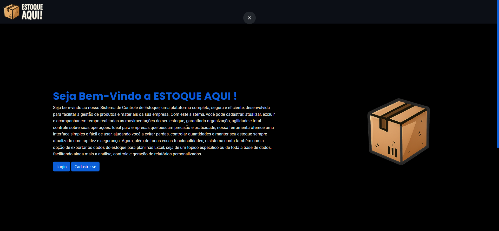
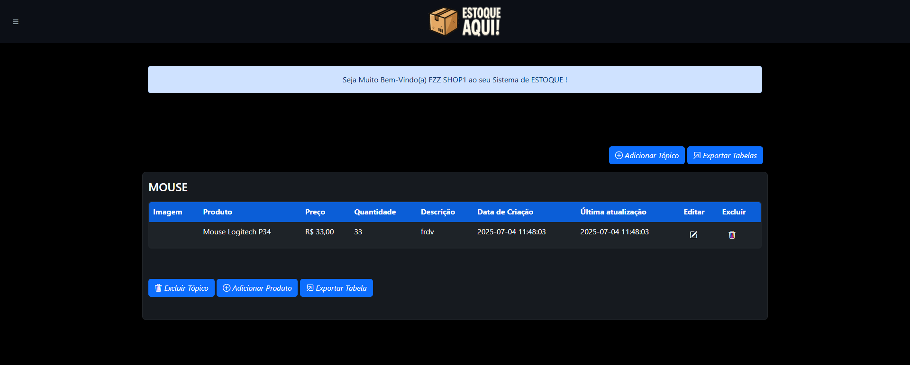
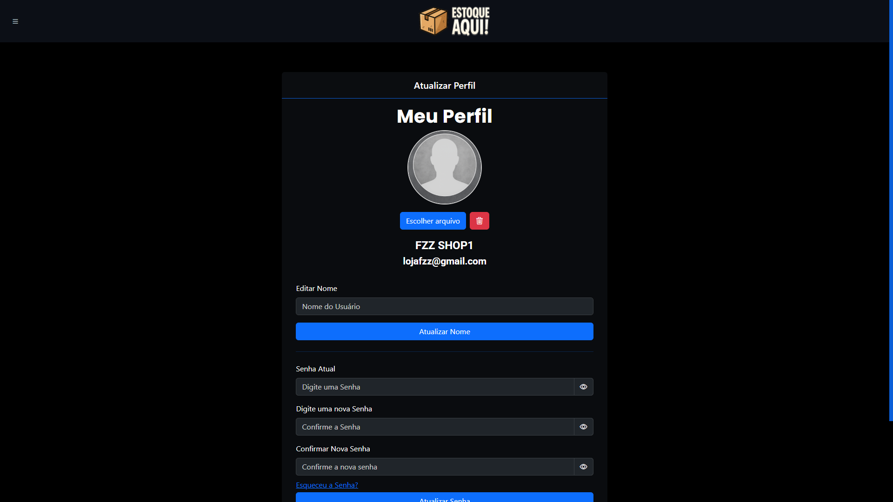

[](https://git.io/typing-svg)

<p align="center">
  
</p>

---

<p align="center">
  <a href="#sobre-o-projeto"></a>
  <a href="#tecnologias-utilizadas"></a>
  <a href="#funcionalidades"></a>
  <a href="#screenshots"></a>
  <a href="#roadmap"></a>
  <a href="#como-executar"></a>
  <a href="#contato"></a>
  <a href="#licenca"></a>
</p>

---

## 📌 Sobre o projeto

**Estoque Aqui** é um sistema web moderno para gerenciamento completo de estoque, focado em simplicidade, agilidade e eficiência.  
Oferece cadastro, edição, exclusão e visualização de produtos, simulação de vendas, gerenciamento de usuários e controle de perfil com upload e remoção de fotos. Ideal para pequenas e médias empresas que desejam controle eficaz e acessível de seus produtos.

---

## 🚀 Tecnologias utilizadas

### Front-end
<p align="center">
  <code></code>
  <code></code>
  <code></code>
  <code></code>
</p>

### Back-end
<p align="center">
  <code></code>
  <code></code>
</p>

### Ferramentas
<p align="center">
  <code></code>
  <code></code>
  <code></code>
</p>

---

## 📚 Bibliotecas utilizadas

- **PHPMailer** — envio de e-mails por SMTP  
- **PhpSpreadsheet** — geração de planilhas Excel  
- **Cropper.js** — corte de imagem para avatar

---

## ✅ Funcionalidades

- CRUD completo de produtos  
- Simulação de vendas com cálculo total  
- Exportação de dados  
- Upload, corte e exclusão de foto de perfil  
- Gerenciamento de usuários  
- Interface 100% responsiva  

---

## 📸 Screenshots

<p align="center">
  
  
  
</p>

---

## 🛣️ Roadmap

- [x] CRUD de Produtos  
- [x] Simulação com exportação  
- [x] Upload de foto  
- [ ] Dashboard com gráficos
---

## 🧪 Como executar

```bash
# Clone o repositório
git clone https://github.com/wesleysilva6/CRUD.wesley.git

# Importe o banco de dados crud_login.sql

# Configure o arquivo de conexão:
includes/core/conexao.php

# Inicie seu servidor Apache + MySQL (XAMPP, WAMP ou Laragon)

# Acesse o sistema no navegador:
http://localhost/public/index.php
```
---

<h2 align="center">📬 Contato</h2>
<p align="center">Entre em contato comigo pelos canais abaixo:</p>
<p align="center">
  <a href="https://www.linkedin.com/in/wesley-wagner-nunes-silva/" target="_blank">
    
  </a>
</p>

---

<p align="center">    </p>