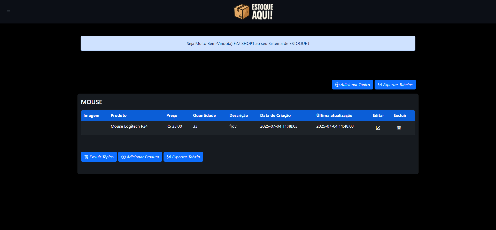
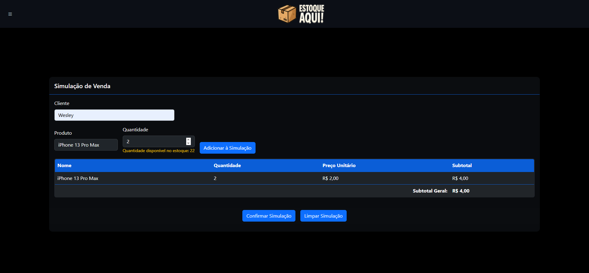
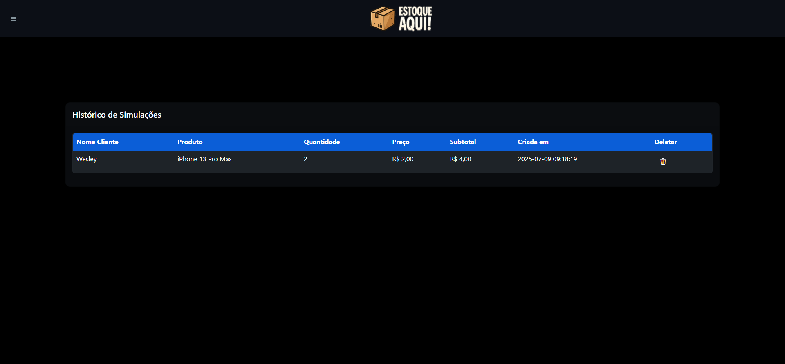
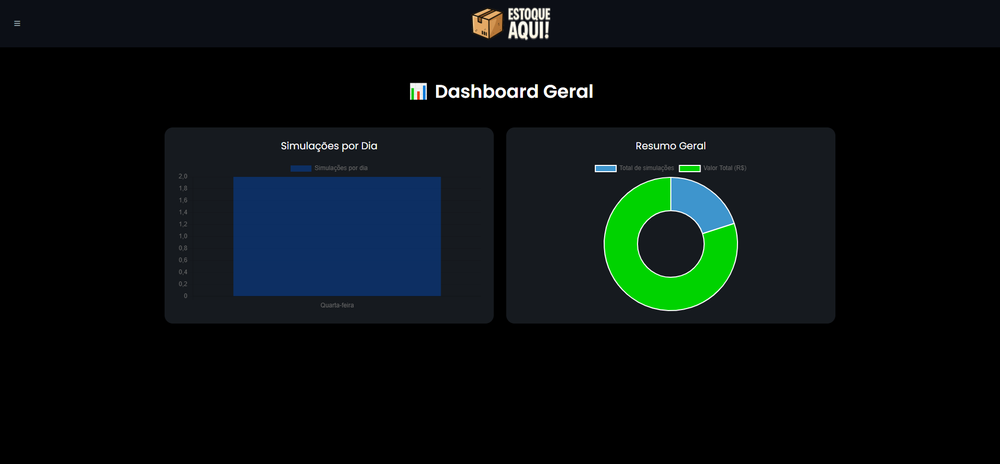

[](https://git.io/typing-svg)

<p align="center">
  
</p>

---

<p align="center">
  <a href="#📌-sobre-o-projeto"></a>
  <a href="#🚀-tecnologias-utilizadas"></a>
  <a href="#✅-funcionalidades"></a>
  <a href="#📸-screenshots"></a>
  <a href="#🛣️-roadmap"></a>
  <a href="#🧪-como-executar"></a>
  <a href="#📬-contato"></a>
</p>

---

## 📌 Sobre o Projeto

🎯 **Estoque Aqui** é um sistema web moderno e intuitivo para gerenciamento de estoque, ideal para pequenas e médias empresas.  

Funcional, responsivo e com foco na experiência do usuário, ele permite:
- ✅ Controle completo de produtos
- 📦 Simulação e histórico de vendas
- 👥 Gerenciamento de usuários
- 📊 Dashboard com gráficos dinâmicos
- 🖼️ Upload e recorte de foto de perfil

---

## 🚀 Tecnologias Utilizadas

### Front-end
<p align="center">
  <code></code>
  <code></code>
  <code></code>
  <code></code>
</p>

### Back-end
<p align="center">
  <code></code>
  <code></code>
</p>

### Ferramentas & Utilitários
<p align="center">
  <code></code>
  <code></code>
  <code></code>
</p>

---

## 📚 Bibliotecas Utilizadas

- 📧 **PHPMailer** — envio de e-mails via SMTP  
- 📊 **Chart.js** — gráficos interativos e dinâmicos  
- 📥 **PhpSpreadsheet** — exportação de planilhas Excel  
- ✂️ **Cropper.js** — recorte de imagem para avatar

---

## ✅ Funcionalidades

- ✅ CRUD de Produtos  
- 🛒 Simulação de Vendas com Cálculo Total  
- 📁 Exportação de Dados (Excel)  
- 👤 Upload, Corte e Exclusão de Foto de Perfil  
- 👥 Cadastro e Login de Usuários  
- 📊 Dashboard com Gráficos Analíticos (Bar & Doughnut)

---

## 📸 Screenshots

<p align="center">
  
  
  
  
  
  
</p>

---

## 🛣️ Roadmap

- [x] CRUD de Produtos  
- [x] Simulação com Exportação  
- [x] Upload e Corte de Foto  
- [x] Dashboard com Gráficos  
- [ ] 📅 Filtro de simulações por período  
- [ ] 🔔 Notificações de estoque baixo  
- [ ] 📦 Histórico de movimentações de estoque  
- [ ] 📱 Responsividade total para mobile

---

## 🧪 Como Executar

```bash
# 1. Clone o repositório
git clone https://github.com/wesleysilva6/CRUD.wesley.git

# 2. Importe o banco de dados (arquivo sql/crud_login.sql)

# 3. Configure o banco em:
includes/core/conexao.php

# 4. Inicie o servidor Apache + MySQL (XAMPP, WAMP ou Laragon)

# 5. Acesse no navegador:
http://localhost/public/index.php
```
---

<h2 align="center">📬 Contato</h2>
<p align="center">Entre em contato comigo pelos canais abaixo:</p>
<p align="center">
  <a href="https://www.linkedin.com/in/wesley-wagner-nunes-silva/" target="_blank">
    
  </a>
</p>

---

<p align="center">    </p>
